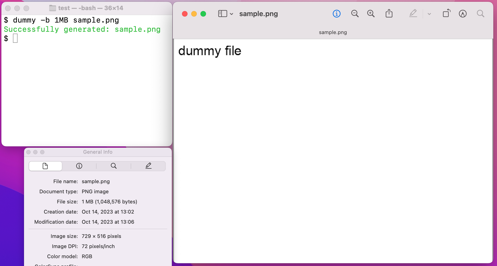

# dummy
[](https://github.com/sterrasec/dummy/blob/master/LICENSE)


Generator of static files for testing file upload functionality.

Supported file types:
- csv
  - For checking if the worksheet function works
- jpeg
- png
- pdf

When generating a png, as in the following screenshot, you can generate a png of a specified size.



## Motivation
I often test the file upload function during security testing. 
I am always at a loss as to what kind of images to upload at that time. 
I am not comfortable uploading an image of an Internet meme or a delicious meal to my client's server. 
So I created `dummy` to create images that don't give a bad impression.

Also, when testing whether a large file can be uploaded, it is often difficult to prepare a large file. 
To solve this, `dummy` has the ability to generate a png of any size by adding an extra chunk to the png.

## Installation

Since `dummy` is implemented in Python, it can be installed with the pip command, which is a Python package management system.
On Windows, the following pip command must be executed as administrator to generate `dummy.exe`.

```bash
$ pip install git+https://github.com/sterrasec/dummy.git
```

## Usage
The command outputs are displayed in color. 
Just specify the file path for csv, png, jpeg, or pdf and the file will be generated. 
By default, the generated file is written "dummy file". This text can be changed with the `-t` option.

```bash
$ dummy test.jpeg
```

You can also specify the number of bytes in the file when generating csv and png files with the `-b` option.
To specify bytes, you can use B, KB, MB, or GB as a unit.

```bash
$ dummy -t abc -b 1MB test.png
```

You can check your options at any time by checking help.

```bash
$ dummy -h
usage: dummy [-h] [-t TEXT] [-b BYTES] file_path

Create a dummy file for testing.

positional arguments:
  file_path             Path to the generated file(.csv .jpeg, .png, .pdf)

options:
  -h, --help            show this help message and exit
  -t TEXT, --text TEXT  Text to be written in the file(Disabled in csv)
  -b BYTES, --bytes BYTES
                        Bytes of file(.png, .csv)
```

## License
MIT License
